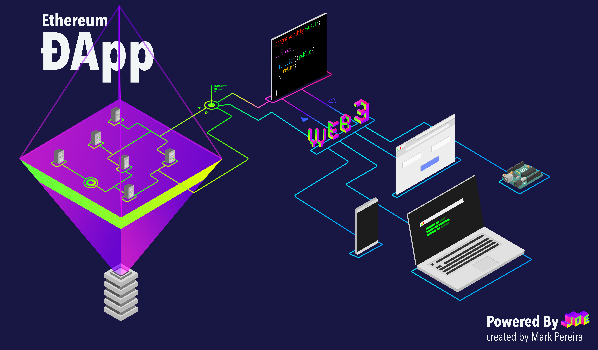

# Simple Ropsten ÐApp

ÐApp containing smart contract function calls and signing. 

This is the smart contract that the ÐApp interacts with below.

```
pragma solidity ^0.4.18;

contract Id {
    
   string fName;
   uint age;
   
   function setId(string _fName, uint _age) public {
       fName = _fName;
       age = _age;
   }
   
   function getId() public constant returns (string, uint) {
       return (fName, age);
   }
    
}

```



What is a ÐApp?

ÐApp is an abbreviated form for decentralized application.

A ÐApp has its backend code running on a decentralized peer-to-peer network. Contrast this with an app where the backend code is running on centralized servers.

A ÐApp can have frontend code and user interfaces written in any language (just like an app) that can make calls to its backend. Furthermore, its frontend can be hosted on decentralized storage such as Swarm or IPFS.

-"https://ethereum.stackexchange.com/questions/383/what-is-a-dapp"

# Get Started

Go into your terminal and choose a directory that you want the project to reside in.
Enter into your terminal
`git clone https://github.com/markspereira/ropsten_example_dapp.git`

### If you haven't installed node.js

#### Install NVM

Check to see if you have nvm by running ``` nvm --version ``` in your terminal

If not then download it from
https://github.com/creationix/nvm

#### Install Node.js

Check to see if you have node by running ```node --version``` in your terminal

If you don't then

``` nvm install 8.60.0 ```

Go into the root directory of the app
```cd ropsten_example_dapp```

Then enter
```npm install```

Then 
```npm start```

You can then look into `src/App.js` to see the code I've written.

# Happy coding! 🎉